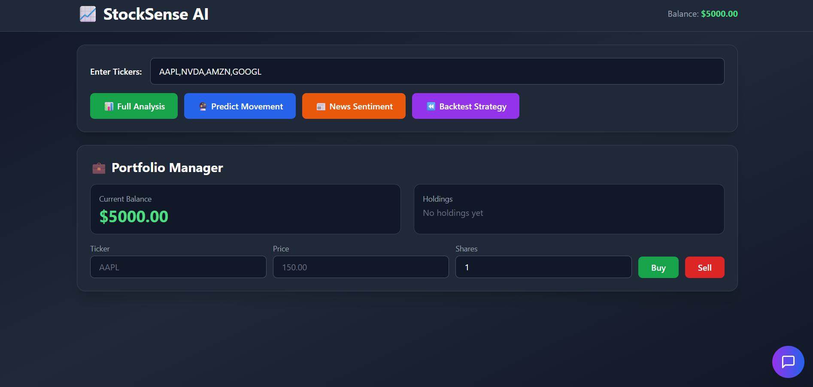
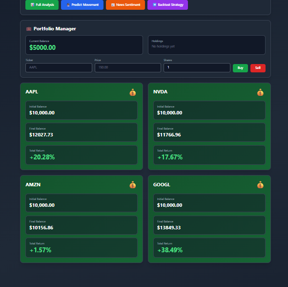

# 📈 StockSense AI

StockSense AI is a modern, interactive web platform for AI-driven stock prediction, portfolio management, news sentiment analysis, and backtesting. Built for traders, students, and finance enthusiasts, it uses machine learning models (RandomForest, scikit-learn), yfinance, pandas, and a Flask backend.  

---

## Features

- 📊 Multi-ticker technical and ML analysis with real-time charting  
- 🤖 Predict price movements and show model accuracy  
- 📰 News sentiment analysis using NewsAPI, Bloomberg, Reuters  
- 💼 Portfolio simulation with buy/sell at market price  
- 🧪 Backtest classic strategies  
- 🔒 Modern authentication (Auth0) for secure user sessions  
- 🚦 Dashboard UI with AI assistant powered by Gemini Flash 2.5  

---

## 📦 Requirements

All dependencies are listed in `requirements.txt`:

---
Flask==3.0.0
Flask-SQLAlchemy==3.1.1
Flask-Login==0.6.3
Werkzeug==3.0.1
python-dotenv==1.0.0
python-dotenv>=0.19.2
authlib>=1.0
requests>=2.27.1
yfinance>=0.2.28
pandas>=1.3.5
scikit-learn>=1.0
matplotlib>=3.5.0
flask-cors>=4.0.0
---

## Getting Started

1. Clone this repository.
2. Install dependencies:  
   `pip install -r requirements.txt`
3. Start the backend server:  
   `python -m app.api_server`
4. Open your browser at [http://localhost:5000](http://localhost:5000) and log in!

---

## Technologies Used

- Flask, Flask-SQLAlchemy, Flask-Login, flask-cors
- yfinance, pandas, scikit-learn, matplotlib
- Authlib, python-dotenv, requests
- Auth0 (for secure login)
- Gemini Flash 2.5 for AI assistant

---

## License

MIT

---

*Built for HackUTA 2025*

